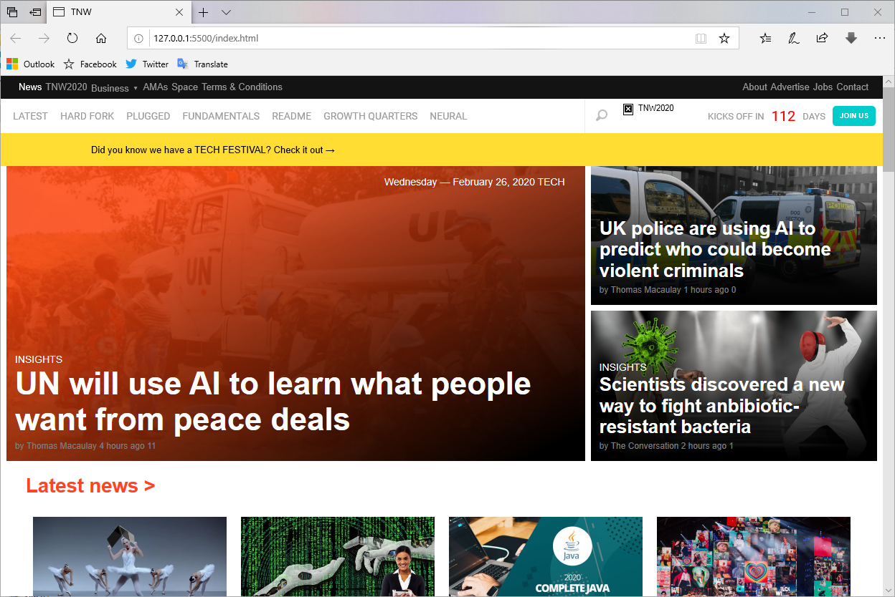

# Responsive Design

> This is an HTML & CSS project build with the intended of practice some responsive knowledge owned, the project is about cloning a famous web page, The Next Web, this was an exercise and not a direct copy, the HTML and CSS structure may vary.

You can find the link of the original page where this project was clone from [here](https://thenextweb.com/).

## Built With

- HTML
- CSS

## Live Demo

[Live Demo Link](https://rawcdn.githack.com/meme-es/responsive/development/)

## Authors

👤 **Angel Mora**

- Github: [@angel-mora](https://github.com/angel-mora)
- Twitter: [@angelmoma_](https://twitter.com/angelmoma_)
- Linkedin: [linkedin](https://www.linkedin.com/in/angelmoma/)

👤 **Manuel**
- Github: [@meme-es](https://github.com/meme-es)
- Twitter: [@meme_es](https://twitter.com/meme_es)
- Linkedin: [linkedin](https://www.linkedin.com/in/manuel-elias-b289a638/)

## 🤝 Contributing

Contributions, issues and feature requests are welcome!

Feel free to check the [issues page](https://github.com/meme-es/responsive/issues).

## Show your support

Give a ⭐️ if you like this project!

## 📝 License

There is no license for this work.